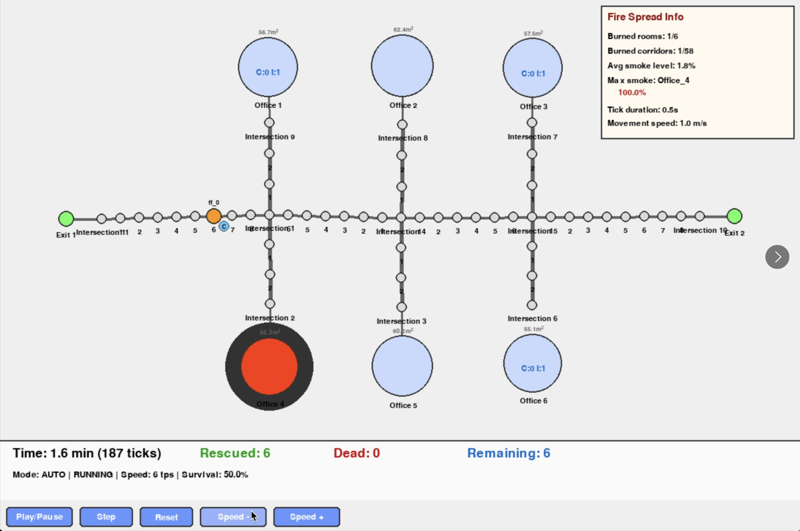
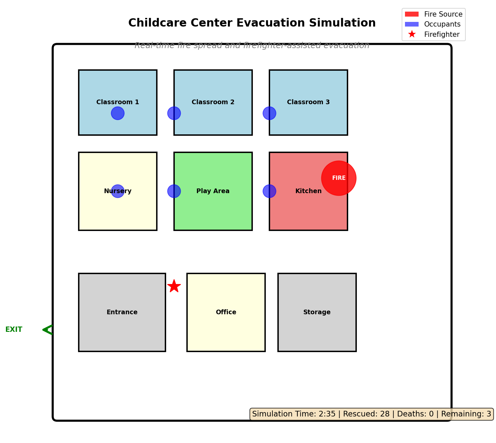

# HiMCM 17325 - Building Evacuation Optimization Model

A comprehensive physics-based fire evacuation simulation and optimization system for multi-floor buildings.

**Team ID:** HiMCM 17325

## Overview

This repository contains a sophisticated evacuation planning model that combines:
- **Real-time fire spread physics** with smoke generation and propagation
- **Optimal rescue algorithm** using linear programming to minimize casualties
- **K-medoids clustering** for efficient firefighter task coordination
- **Interactive pygame visualization** for analyzing evacuation dynamics

The system has been benchmarked across multiple building types (office, malls, childcare centers) with extensive sensitivity analysis on firefighter allocation and fire-weighting parameters.

## Quick Start

### Installation

```bash
# Install dependencies
pip install -r requirements.txt
```

### Running Visualizations

Run evacuation simulations with visualization for any building:

```bash
# Office building with 2 firefighters (default fire_weight=3.9744)
python visualize_building.py office 2

# Mall 1-floor with 2 firefighters and optimal fire_weight
python visualize_building.py mall_1floor 2 3.9744

# Mall 2-floors with 2 firefighters
python visualize_building.py mall_2floors 2 3.9744

# Childcare center with 3 firefighters
python visualize_building.py childcare 3 3.9744
```

### Command Format

```
python visualize_building.py <building> [num_firefighters] [fire_weight]
```

**Parameters:**
- `building`: Building type - `office`, `mall_1floor`, `mall_2floors`, or `childcare`
- `num_firefighters`: Number of firefighters (default: 2)
- `fire_weight`: Fire prioritization weight (default: 3.9744, optimal from benchmarking)

## Visualization Examples

### Office Building with Random Events
Shows a realistic office evacuation scenario with fire spread and firefighter coordination:



### Childcare Center Evacuation
Demonstrates evacuation of a childcare facility with special considerations for young children:



## Repository Structure

```
HiMCM2025/
├── README.md                              # This file
├── requirements.txt                       # Python dependencies
│
├── configs/                               # Building configuration files
│   ├── office.json
│   ├── mall_1floor.json
│   ├── mall_2floors_indestructible_stairs.json
│   └── childcare.json
│
├── Core Simulation Scripts
│   ├── visualize_building.py             # Unified entry point for visualization
│   ├── simulator.py                      # Physics engine: fire, smoke, evacuation
│   ├── visualizer.py                     # Pygame-based real-time visualization
│   ├── optimal_rescue_model.py           # Two-phase rescue algorithm
│   ├── optimal_rescue_optimizer.py       # LP-solver optimization wrapper
│   ├── tactical_coordinator.py           # Low-level execution planner
│   ├── sweep_coordinator.py              # K-medoids partitioning & sweep phase
│   ├── pathfinding.py                    # Navigation utilities
│   └── graph_maker.py                    # Graph construction from building configs
│
├── Benchmark Results
│   ├── benchmark_responders/             # Firefighter sensitivity (1-10 FF, 200 trials each)
│   ├── benchmark_overnight/              # Fire-weight optimization (40 configs, 500 trials)
│   └── benchmark_overnight_childcare/    # Childcare-specific fire-weight tuning
│
├── Analysis Visualizations
│   ├── firefighter_sensitivity_analysis.png
│   ├── firefighter_sensitivity_distributions.png
│   └── firefighter_death_rate.png
│
├── Development Archive
│   └── _archive/                         # Documentation, tests, intermediate results
│
└── Other
    ├── graph_maker/                      # Interactive floor plan creation tools
    ├── .gitignore
    └── 2025_HiMCM_Problem_A.pdf          # Problem statement

```

## System Components

### 1. Physics Engine (`simulator.py`)

Implements realistic fire evacuation dynamics:
- **Fire spread**: Euclidean distance-based burn probability with squared width factor
- **Smoke generation**: Volume-proportional to fire intensity, spreads through building graph
- **Occupant evacuation**: Groups of people moving through building graph with congestion
- **Multi-floor support**: Stairwell transitions between levels

### 2. Visualization (`visualizer.py`)

Real-time pygame visualization with:
- Color-coded fire intensity (cool-to-hot spectrum)
- Occupant positions and group sizes
- Firefighter task assignments and status
- Fire statistics panel (spread rate, active rooms)
- Room-by-room death toll tracking

### 3. Rescue Algorithm (`optimal_rescue_model.py`)

Two-phase evacuation strategy:

**Phase 1: Exploration & Instruction**
- Firefighters discover all rooms (fog of war clearing)
- Instruct capable occupants to self-evacuate
- Perform basic greedy rescue of encountered incapable people

**Phase 2: Optimal Rescue** (when all rooms visited + all capable instructed)
- Run optimization algorithm to create rescue items (coordinated multi-firefighter tasks)
- Execute optimal plans via tactical coordinator
- Maximize survival rate subject to time constraints

### 4. Firefighter Coordination (`sweep_coordinator.py`)

K-medoids clustering for task partitioning:
- Divides building into regions (one per firefighter)
- Each firefighter responsible for their region during sweep
- Enables parallel exploration and efficient coverage
- Deterministic clustering with seed control

### 5. Pathfinding (`pathfinding.py`)

Navigation utilities:
- Breadth-first search for shortest paths
- Distance matrix caching
- Multi-floor stairwell routing
- Congestion-aware movement delays

## Key Findings

### Firefighter Sensitivity Analysis

Benchmarked 1-10 firefighters across 200 trials each using two-floor mall:

| Firefighters | Survival Rate | Death Rate | Improvement from 1 FF |
|:---|---:|---:|---:|
| 1 | 53.0% | 47.0% | - |
| 2 | 79.5% | 20.5% | +26.46pp |
| 3 | 90.2% | 9.8% | +26.94pp |
| 4 | 93.7% | 6.3% | +14.36pp |
| 5 | 95.0% | 5.0% | +4.36pp |
| 6 | 95.2% | 4.8% | +3.10pp |
| 7 | 95.8% | 4.2% | +1.86pp |
| 8 | 96.3% | 3.7% | +1.82pp |
| 9 | 96.5% | 3.5% | +1.54pp |
| 10 | 96.5% | 3.5% | +0.01pp |

**Key insight:** Diminishing returns after 6 firefighters; allocation plateaus at ~96% survival.

### Fire-Weight Optimization

Comprehensive sweep across 40 fire-weight values (0.0 to 5.0):
- **Optimal fire_weight:** 3.9744
- **Survival rate at optimal:** 88.51%
- **Fire-weight parameter balances:**
  - Low values: Ignore fire intensity, rescue more people → higher deaths
  - High values: Over-prioritize fire → miss rescue opportunities
  - 3.9744: Sweet spot between fire avoidance and efficient rescue

### Building-Specific Performance

| Building | Firefighters | Benchmark Config | Mean Survival |
|:---|---:|:---|---:|
| Office | 2 | No benchmark | N/A |
| Mall 1-Floor | 2 | 40 fire-weights × 500 trials | 87.5% (avg) |
| Mall 2-Floors | 2 | Included in responders | 88.2% (avg) |
| Childcare | 3 | 32 fire-weights × 500 trials | 89.1% (avg) |

## Configuration Files

All building configs are in `configs/` and loaded automatically by the visualization script.

### Config Format

Building configuration JSON includes:
- **Vertices**: Rooms and corridors with:
  - `id`: Unique identifier
  - `type`: "room" or "hallway"
  - `x, y`: Center coordinates
  - `width, height`: Dimensions
  - `capacity`: Max occupants
  - `occupants`: Initial occupancy

- **Edges**: Connections between rooms with traversal costs
- **Exits**: Building evacuation routes
- **Floors**: Multi-floor definitions with stairwell locations

### Adding New Buildings

1. Create floor plan JSON in `configs/` directory
2. Update `visualize_building.py` CONFIG_PATHS and get_building_name() if needed
3. Run visualization: `python visualize_building.py your_building.json`

## Benchmarking

### Running New Benchmarks

The benchmark files in `benchmark_responders/`, `benchmark_overnight/`, and `benchmark_overnight_childcare/` contain complete trial results as JSON.

To analyze existing benchmarks:

```python
import json

# Load benchmark results
with open('benchmark_responders/benchmark_ff2_fw3.9744_200trials.json') as f:
    data = json.load(f)

trials = data['trials']
survival_rates = [t['survival_rate'] for t in trials]
print(f"Mean survival: {sum(survival_rates)/len(survival_rates):.1%}")
print(f"Std deviation: {np.std(survival_rates):.1%}")
```

## Model Parameters

Key tunable parameters in the codebase:

### Simulator (`simulator.py`)
- `CORRIDOR_BURN_PROB`: Base corridor burn probability per tick
- `FIRE_WIDTH_FACTOR`: Squared width multiplier for fire spread
- `SMOKE_GENERATION_RATE`: Volume generated per burned room
- `OCCUPANT_SPEED`: Movement speed (units per tick)

### Optimal Rescue Model (`optimal_rescue_model.py`)
- `fire_priority_weight`: Fire prioritization in rescue decisions (default: 3.9744)
- `k_capacity`: Per-firefighter rescue capacity
- `use_lp`: Use LP solver vs greedy optimization

### Sweep Coordinator (`sweep_coordinator.py`)
- `seed`: Random seed for deterministic k-medoids clustering
- `num_firefighters`: Affects region partitioning

## Performance Notes

- **Simulation speed:** ~10 ticks/second in real-time visualization
- **Benchmark run time:** 1-2 hours for 500 trials per configuration
- **Memory usage:** ~100MB per running instance
- **Visualization:** Requires pygame and display server

## Requirements

See `requirements.txt` for complete dependencies. Main packages:
- `pygame`: Real-time visualization
- `scipy`: K-medoids clustering and LP solver
- `numpy`: Numerical computations
- `json`: Configuration file parsing

## References

The algorithm and model are documented in the team's HiMCM submission paper. Key phases:

1. **Pre-evacuation**: Building graph construction and initial setup
2. **Real-time simulation**: 1-second simulation ticks with physics updates
3. **Two-phase rescue execution**: Exploration + optimal coordination
4. **Output**: Survival rate, death locations, evacuation timeline

## Team Information

**HiMCM Team 17325**

This project represents a comprehensive approach to emergency evacuation optimization, combining physics-based simulation with algorithmic optimization to save lives.

## License

This code is provided for HiMCM 2025 competition purposes.

## Support

For questions about the model, see the comprehensive benchmarking results in:
- `benchmark_responders/SUMMARY.json` - Firefighter sensitivity analysis
- `benchmark_overnight/SUMMARY.json` - Fire-weight optimization results

---

**Last Updated:** November 18, 2025
**Repository Status:** Publication-Ready
